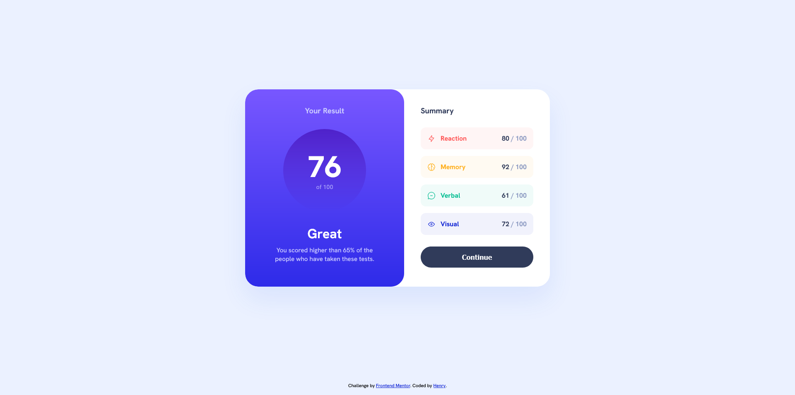

# Results summary component 

This is a solution to the [Results summary component challenge on Frontend Mentor](https://www.frontendmentor.io/challenges/results-summary-component-CE_K6s0maV). 

## Table of contents

- [Overview](#overview)
  - [The challenge](#the-challenge)
  - [Screenshot](#screenshot)
  - [Links](#links)
- [My process](#my-process)
  - [Built with](#built-with)
  - [What I learned](#what-i-learned)
- [Author](#author)

## Overview

### The challenge

Users should be able to:

- View the optimal layout for the interface depending on their device's screen size
- See hover and focus states for all interactive elements on the page
- **Bonus**: Use the local JSON data to dynamically populate the content

### Screenshot



### Links

- Solution URL: [https://github.com/Henrydevlab/results-summary-component](https://github.com/Henrydevlab/results-summary-component)
- Live Site URL: [https://henrydevlab.github.io/results-summary-component/](https://henrydevlab.github.io/results-summary-component/)

## My process

### Built with

- Semantic HTML5 markup
- CSS custom properties
- Flexbox
- CSS Grid
- Mobile-first workflow
- BEM (Block-Element-Modifier)
- Vanila Javscript

### What I learned

During this project, I learned how to completely isolate and resolve viewport centering issues by setting a `min-height: 100vh` on the global body alongside a structured flex layout map. 

I also learned how to dynamically compute a combined overall average score directly out of raw values within a JSON payload, injection-protecting the DOM, and parsing structural classes on-the-fly using a key modifier hash layout map.

```css
/* Using explicit BEM methodology alongside transparency configurations */
.summary-row--reaction {
  background-color: hsla(0, 100%, 67%, 0.06);
  color: var(--clr-primary-red);
}
```
```js
// Dynamically computing math arrays directly from the local data response payload
const averageScore = Math.round(totalScoreSum / dataArray.length);
mainScoreDisplay.textContent = averageScore;
mainScoreDisplay.parentElement.setAttribute('aria-label', `Score: ${averageScore} out of 100`);
```

## Author

- Frontend Mentor - [@henrydevlab](https://www.frontendmentor.io/profile/henrydevlab)
- Twitter - [@henrydevlab](https://www.twitter.com/henrydevlab)
